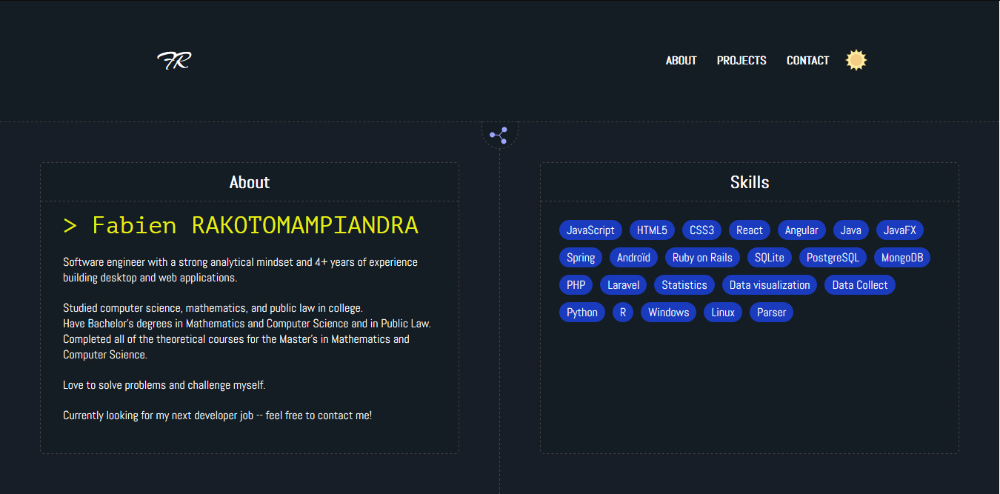

# About me
I'm a software engineer with a strong analytical mindset.
I studied computer science, mathematics, and public law in college.
I have Bachelor's degrees in both and also completed all of the theoretical courses for my Master's in Mathematics and Computer Science.
I have more than 3 years of experience in building desktop and web applications.
Currently, I'm starting to build mobile apps.

# Projects
- Calculata
  - [Live demo](https://calculata.herokuapp.com/)
  - [Source Code](https://github.com/FabienNeibaf/Calculator)
- Battleship
  - [Live demo](https://fabienneibaf.github.io/Battleship/)
  - [Source Code](https://github.com/FabienNeibaf/Battleship)
- Earthdiary
  - [Live demo](https://earthdiary.herokuapp.com/)
  - [Source Code](https://github.com/maelfosso/microverse_ror_final_project)
- Tada
  - [Live demo](https://fabienneibaf.github.io/TodoList/)
  - [Source Code](https://github.com/FabienNeibaf/TodoList)
- Tictactoe
  - [Live demo](https://fabienneibaf.github.io/TicTacToe/)
  - [Source Code](https://github.com/FabienNeibaf/TicTacToe)
- Weather
  - [Live demo](https://fabienneibaf.github.io/Weather-App/)
  - [Source Code](https://github.com/FabienNeibaf/Weather-App)
- Dashboard
  - [Live demo](https://fabienneibaf.github.io/Dashboard/)
  - [Source Code](https://github.com/FabienNeibaf/Dashboard)

# Author
- Github: https://github.com/FabienNeibaf
- Email: fabienrakotomampiandra@gmail.com

# Follow me
- [LinkedIn](https://www.linkedin.com/in/fabien-rakotomampiandra-96567b17b/)
- [AngelList](https://angel.co/fabien-rakotomampiandra)
- [Twitter](https://twitter.com/Neibaflintone)
